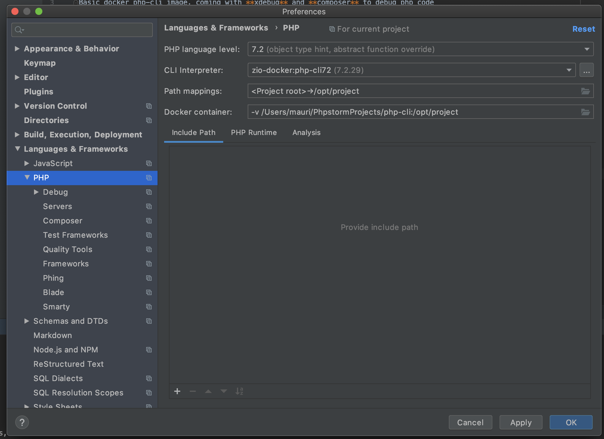
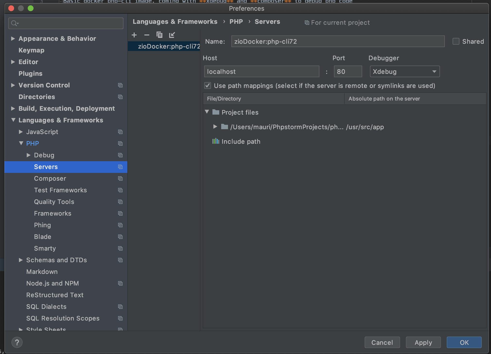
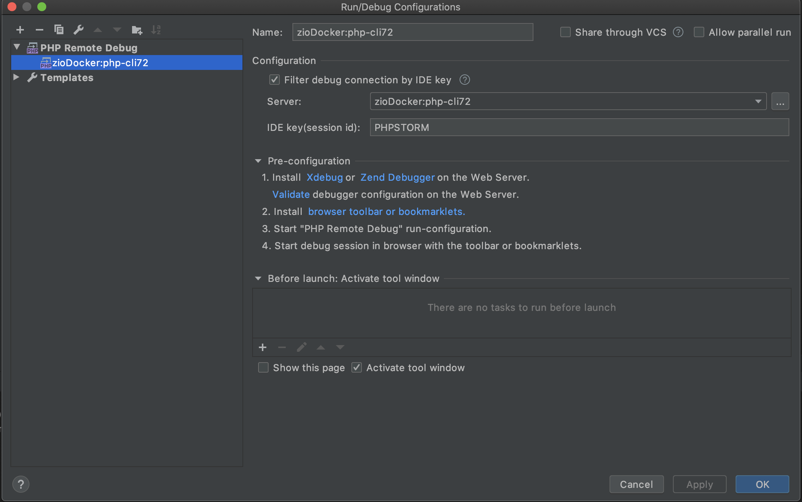
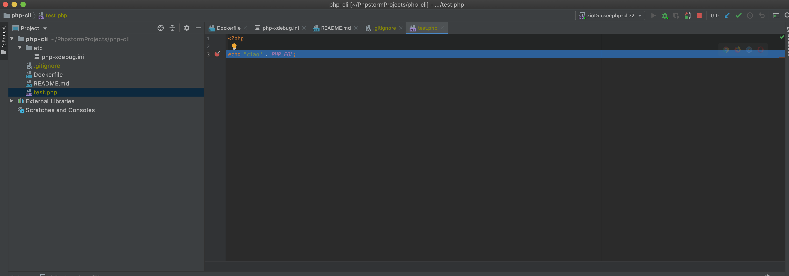

php-cli-xdebug
---
Basic docker php-cli image, coming with **xdebug** and **composer** to debug php code

## Build the image
```
docker build -t zio-docker:php-cli72 .
```

## Run the container

```
docker run --rm -v $(pwd):/usr/src/app zio-docker:php-cli72 bash -c "php test.php"
```

## Set it up in php storm
* Build your image, so u have it on your local system
* Go to preferences->Languages & Frameworks->PHP and add a new interpreter, choosing Docker



* Always inside the preferences add a new server:



* Now add a remote debug from the dropdown in the right corner of phpstorm



* Enjoy debugging


